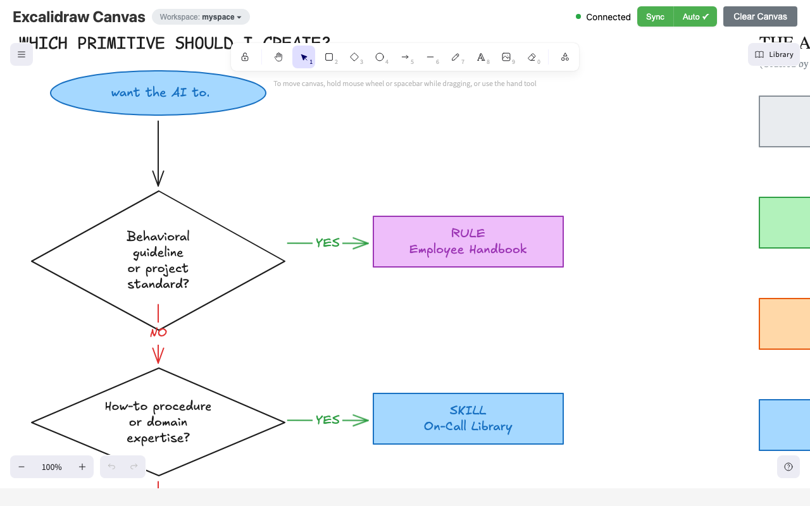
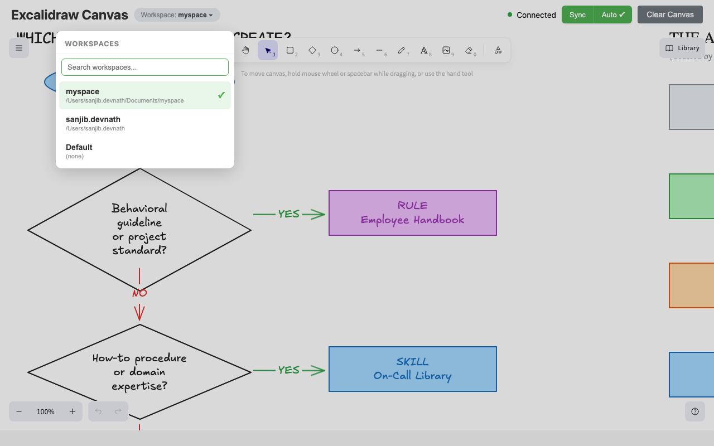
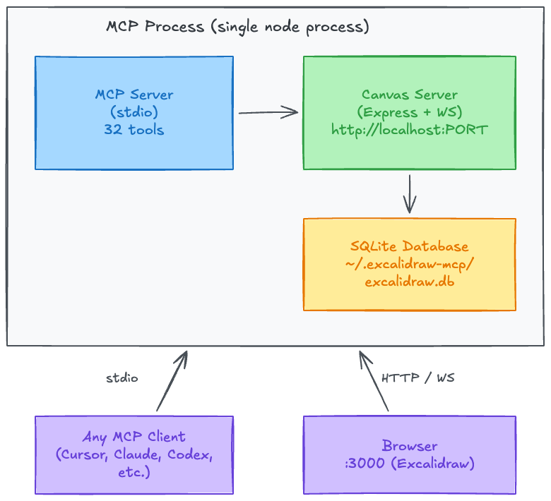

# MCP Excalidraw Local

[](https://github.com/sanjibdevnathlabs/mcp-excalidraw-local/actions/workflows/ci.yml)
[](https://github.com/sanjibdevnathlabs/mcp-excalidraw-local/actions/workflows/release.yml)
[](LICENSE)

A fully local, self-hosted Excalidraw MCP server with **SQLite persistence**, **multi-tenancy**, and **auto-sync** — designed to run entirely on your machine without depending on `excalidraw.com`.

Run a live Excalidraw canvas and control it from any AI agent. This repo provides:

- **MCP Server**: 32 tools over stdio — works with any MCP-compatible client
- **Agent Skill**: Portable skill with workflow playbooks, cheatsheets, and helper scripts
- **Live Canvas**: Real-time Excalidraw UI synced via WebSocket
- **SQLite Persistence**: Elements survive restarts, with versioning and search
- **Multi-Tenancy**: Isolated canvases per workspace, auto-detected

> **Fork notice:** This project is forked from [yctimlin/mcp_excalidraw](https://github.com/yctimlin/mcp_excalidraw) and extends it with persistence, multi-workspace support, and numerous UX improvements. Full credit to the original author for the excellent foundation. See [What Changed From Upstream](#what-changed-from-upstream) for details.

Keywords: Excalidraw MCP server, AI diagramming, local Excalidraw, self-hosted, SQLite persistence, multi-tenant, Mermaid to Excalidraw.

## Screenshots

### Canvas UI

The live Excalidraw canvas with toolbar, connection status, sync controls, and workspace badge:



### Workspace Switcher

Click the workspace badge to switch between isolated canvases — each workspace has its own set of diagrams:



> For a demo of the upstream project (before persistence/multi-tenancy), see the [original video by @yctimlin](https://youtu.be/ufW78Amq5qA).

## Table of Contents

- [Screenshots](#screenshots)
- [Prerequisites](#prerequisites)
- [Quick Start](#quick-start)
- [Configuration](#configuration)
- [Verify Installation](#verify-installation)
- [Updating](#updating)
- [How We Differ from the Official Excalidraw MCP](#how-we-differ-from-the-official-excalidraw-mcp)
- [What Changed From Upstream](#what-changed-from-upstream)
- [Architecture](#architecture)
- [Environment Variables](#environment-variables)
- [Multi-Tenancy (Workspaces)](#multi-tenancy-workspaces)
- [Agent Skill (Optional)](#agent-skill-optional)
- [MCP Tools (32 Total)](#mcp-tools-32-total)
- [Testing](#testing)
- [Troubleshooting](#troubleshooting)
- [Known Issues / TODO](#known-issues--todo)
- [Development](#development)
- [Credits](#credits)

## Prerequisites

| Requirement | Why | Check |
|---|---|---|
| **Node.js >= 20** (LTS 20 or 22 recommended) | Runtime | `node --version` |
| **C++ build tools** | `better-sqlite3` compiles native bindings | See below |
| **npm** (bundled with Node.js) | Package manager | `npm --version` |

### C++ build tools by platform

**macOS:**
```bash
xcode-select --install
```

**Ubuntu / Debian:**
```bash
sudo apt install build-essential python3
```

**Windows:**
Install "Desktop development with C++" from [Visual Studio Build Tools](https://visualstudio.microsoft.com/visual-cpp-build-tools/).

> `better-sqlite3` ships prebuilt binaries for most Node LTS versions. The build tools are only needed when a prebuilt binary isn't available for your platform/Node combination.

## Quick Start

### Path A: Interactive Setup (recommended for first-time users)

The setup wizard checks your environment, optionally installs the agent skill, and configures MCP clients — all interactively. Every step is skippable.

```bash
npx @sanjibdevnath/mcp-excalidraw-local setup
```

<details>
<summary>Example session</summary>

```
$ npx @sanjibdevnath/mcp-excalidraw-local setup

  Excalidraw MCP — Setup

  [1/3] Environment
    ✔ Node.js v22.12.0 .................. OK
    ✔ better-sqlite3 bindings ........... OK
    ✔ Frontend build .................... OK

  [2/3] Agent Skill
  Install the Excalidraw agent skill? [Y/n]: Y

  Detected agents:
    [1] Cursor       (~/.cursor)
    [2] Claude Code  (~/.claude)

  Which agents? (comma-separated, 'all', or 'skip'): all

  Cursor — scope? [G]lobal / [l]ocal: G
    ✔ Installed to ~/.cursor/skills/excalidraw-skill/

  Claude Code — scope? [G]lobal / [l]ocal: G
    ✔ Installed to ~/.claude/skills/excalidraw-skill/

  [3/3] MCP Configuration
  Add MCP server to agent configs automatically? [Y/n]: Y

  Cursor — add to ~/.cursor/mcp.json? [Y/n]: Y
    ✔ Added 'excalidraw-canvas' to ~/.cursor/mcp.json

  Claude Code — register via CLI? [Y/n]: Y
    ✔ Registered 'excalidraw-canvas' via Claude Code CLI

  Done! Open http://localhost:3000 to verify the canvas.
```
</details>

> **The setup is fully optional.** If you prefer to configure everything manually, skip to Path B or C below.

### Path B: From Source

```bash
git clone https://github.com/sanjibdevnathlabs/mcp-excalidraw-local.git
cd mcp-excalidraw-local

npm install
npm run build
```

Then configure your MCP client — see [Configuration](#configuration).

To run manually (outside an MCP client):
```bash
node dist/index.js
```

Open `http://localhost:3000` in your browser.

### Path C: Docker

Canvas server:
```bash
docker run -d -p 3000:3000 --name mcp-excalidraw-canvas sanjibdevnath/mcp-excalidraw-local-canvas:latest
```

MCP server (stdio) is typically launched by your MCP client:
```json
{
  "mcpServers": {
    "excalidraw-canvas": {
      "command": "docker",
      "args": [
        "run", "-i", "--rm",
        "-e", "CANVAS_PORT=3000",
        "sanjibdevnath/mcp-excalidraw-local:latest"
      ]
    }
  }
}
```

> **Note:** For Docker on Linux, add `--add-host=host.docker.internal:host-gateway`.

## Configuration

This is a standard MCP server communicating over **stdio**. It works with any MCP-compatible client.

### Cursor

Add to `~/.cursor/mcp.json` (global) or `.cursor/mcp.json` (per-project):

```json
{
  "mcpServers": {
    "excalidraw-canvas": {
      "command": "npx",
      "args": ["-y", "@sanjibdevnath/mcp-excalidraw-local"],
      "env": {
        "CANVAS_PORT": "3000"
      }
    }
  }
}
```

Or, if installed from source:

```json
{
  "mcpServers": {
    "excalidraw-canvas": {
      "command": "node",
      "args": ["/absolute/path/to/mcp-excalidraw-local/dist/index.js"],
      "env": {
        "CANVAS_PORT": "3000"
      }
    }
  }
}
```

### Claude Desktop

Add to `claude_desktop_config.json`:

```json
{
  "mcpServers": {
    "excalidraw-canvas": {
      "command": "npx",
      "args": ["-y", "@sanjibdevnath/mcp-excalidraw-local"],
      "env": {
        "CANVAS_PORT": "3000"
      }
    }
  }
}
```

### Claude Code

```bash
claude mcp add excalidraw-canvas --scope user \
  -e CANVAS_PORT=3000 \
  -- npx -y @sanjibdevnath/mcp-excalidraw-local
```

### Codex CLI

Add to `~/.codex/mcp.json`:

```json
{
  "mcpServers": {
    "excalidraw-canvas": {
      "command": "npx",
      "args": ["-y", "@sanjibdevnath/mcp-excalidraw-local"],
      "env": {
        "CANVAS_PORT": "3000"
      }
    }
  }
}
```

### Key points

- **Single process** — The canvas server is embedded. No separate terminal or process needed.
- **Browser required for screenshots** — `export_to_image` and `get_canvas_screenshot` rely on the frontend. Open `http://localhost:3000` in a browser.

## Verify Installation

After configuring your MCP client, verify everything works:

```bash
# 1. Check the canvas server is running
curl http://localhost:3000/health

# 2. Open the canvas in your browser
open http://localhost:3000

# 3. In your AI agent, ask it to:
#    "Create a blue rectangle labeled 'Hello World' on the Excalidraw canvas"
```

If the health check fails, see [Troubleshooting](#troubleshooting).

## Updating

Already installed a previous version? The interactive update wizard is the easiest way to update everything — MCP server **and** agent skills — in one go.

### Interactive Update (recommended)

```bash
npx @sanjibdevnath/mcp-excalidraw-local@latest update
```

<details>
<summary>Example session</summary>

```
$ npx @sanjibdevnath/mcp-excalidraw-local@latest update

  Excalidraw MCP — Update  v1.2.0

  [1/2] Skill Update

  Found 2 existing skill installation(s):
    [1] Cursor (global) — ~/.cursor/skills/excalidraw-skill
    [2] Claude Code (global) — ~/.claude/skills/excalidraw-skill

  Update all 2 installation(s) to v1.2.0? [Y/n]: Y
    ✔ Updated Cursor (global) — ~/.cursor/skills/excalidraw-skill
    ✔ Updated Claude Code (global) — ~/.claude/skills/excalidraw-skill

    2/2 skill(s) updated.

  [2/2] MCP Configuration
  Re-apply MCP server config? (overwrites existing entry) [y/N]: N
    MCP config unchanged.

  Update complete! Restart your MCP client to pick up changes.
```
</details>

The update wizard:
1. **Finds all existing skill installations** across Cursor, Claude Code, and Codex CLI (both global and local scopes)
2. **Updates them in-place** with the latest skill files (SKILL.md, cheatsheet, geometric-thinking reference, helper scripts)
3. **Offers to install** the skill for any detected agent that doesn't have it yet
4. **Optionally re-applies MCP config** if needed

> **Why this matters:** The agent skill contains workflow guidance, sizing rules, color palettes, and anti-patterns that evolve alongside the MCP tools. Updating the MCP server without updating the skill means your AI agent is working with stale instructions.

### Manual Update by Installation Method

If you prefer to update manually, follow the steps for your installation method, then restart your MCP client.

#### npx users

If your MCP config uses `npx -y @sanjibdevnath/mcp-excalidraw-local`, npx caches the package locally and won't automatically fetch new versions.

**Option A — Clear the cache (one-time):**
```bash
npm cache clean --force
```
Then restart your MCP client. npx will download the latest version on next launch.

**Option B — Pin to `@latest` in your MCP config (permanent fix):**

Update the `args` in your MCP config to include `@latest`:
```json
{
  "mcpServers": {
    "excalidraw-canvas": {
      "command": "npx",
      "args": ["-y", "@sanjibdevnath/mcp-excalidraw-local@latest"],
      "env": { "CANVAS_PORT": "3000" }
    }
  }
}
```

This ensures npx always checks for the newest published version.

#### From-source users

```bash
cd mcp-excalidraw-local
git pull origin main
npm install
npm run build
```

#### Docker users

```bash
docker pull sanjibdevnath/mcp-excalidraw-local:latest
docker pull sanjibdevnath/mcp-excalidraw-local-canvas:latest
```

Then recreate your containers (`docker compose up -d` or `docker run` again).

#### Updating the agent skill manually

If you skipped the interactive update, copy the skill files yourself:
```bash
cp -R skills/excalidraw-skill ~/.cursor/skills/excalidraw-skill
cp -R skills/excalidraw-skill ~/.claude/skills/excalidraw-skill
```

### Verify the update

```bash
# Check the running version
curl -s http://localhost:3000/health

# Or check the installed package version
npx @sanjibdevnath/mcp-excalidraw-local --version
```

## How We Differ from the Official Excalidraw MCP

Excalidraw now has an [official MCP](https://github.com/excalidraw/excalidraw-mcp) — it's great for quick, prompt-to-diagram generation rendered inline in chat. We solve a different problem.

| | Official Excalidraw MCP | This Project |
|---|---|---|
| **Approach** | Prompt in, diagram out (one-shot) | Programmatic element-level control (32 tools) |
| **State** | Stateless — each call is independent | Persistent live canvas with real-time sync |
| **Storage** | None | SQLite with WAL mode, versioning, element history |
| **Multi-tenancy** | No | Workspace-based isolation, auto-detected |
| **Element CRUD** | No | Full create / read / update / delete per element |
| **AI sees the canvas** | No | `describe_scene` (structured text) + `get_canvas_screenshot` (image) |
| **Iterative refinement** | No — regenerate the whole diagram | Draw → look → adjust → look again, element by element |
| **Layout tools** | No | `align_elements`, `distribute_elements`, `group / ungroup` |
| **File I/O** | No | `export_scene` / `import_scene` (.excalidraw JSON) |
| **Snapshot & rollback** | No | `snapshot_scene` / `restore_snapshot` |
| **Mermaid conversion** | No | `create_from_mermaid` |
| **Search** | No | `search_elements` — full-text search across labels |
| **Design guide** | `read_me` cheat sheet | `read_diagram_guide` (colors, sizing, layout, anti-patterns) |
| **Viewport control** | Camera animations | `set_viewport` (zoom-to-fit, center on element, manual zoom) |
| **Live canvas UI** | Rendered inline in chat | Standalone Excalidraw app synced via WebSocket |
| **Multi-agent** | Single user | Multiple agents can draw on the same canvas concurrently |
| **Works without MCP** | No | Yes — REST API fallback via agent skill |

## What Changed From Upstream

This fork extends [yctimlin/mcp_excalidraw](https://github.com/yctimlin/mcp_excalidraw) with the following enhancements:

| Area | Upstream | This Fork |
|---|---|---|
| **Storage** | In-memory (lost on restart) | SQLite with WAL mode, versioning, element history |
| **Multi-tenancy** | None | Workspace-based tenant isolation (auto-detected via `server.listRoots()`) |
| **Canvas lifecycle** | Separate process (2 terminals) | Embedded in MCP process (single `node dist/index.js`) |
| **Auto-sync** | Manual "Sync to Backend" button | Debounced auto-sync (3s idle) with manual override |
| **Canvas port** | Hardcoded 3000 | Configurable via `CANVAS_PORT` env var |
| **MCP tools** | 26 | 32 (added search, history, tenants, projects) |
| **Workspace switcher** | None | Dropdown with search in canvas UI |
| **Sync normalization** | Bound text breaks on reload | Elements normalized to MCP format before storage |

## Architecture



- **Single process**: The MCP server embeds the canvas server. Starting the MCP starts both; stopping it stops both.
- **SQLite**: Stored at `~/.excalidraw-mcp/excalidraw.db` by default. WAL mode + `busy_timeout` for multi-process safety.
- **Multi-tenancy**: Each workspace gets an isolated tenant (SHA-256 hash of workspace path). The UI shows a workspace switcher dropdown with search.

## Environment Variables

| Variable | Description | Default |
|----------|-------------|---------|
| `CANVAS_PORT` | Port for the embedded canvas server | `3000` |
| `EXCALIDRAW_DB_PATH` | Path to the SQLite database file | `~/.excalidraw-mcp/excalidraw.db` |
| `EXCALIDRAW_EXPORT_DIR` | Allowed directory for file exports | `process.cwd()` |
| `EXPRESS_SERVER_URL` | Canvas server URL (only if running canvas separately) | `http://localhost:3000` |

## Multi-Tenancy (Workspaces)

Each workspace (codebase) gets an isolated canvas. The tenant is identified by a SHA-256 hash of the workspace path.

### How it works

1. **Auto-detection**: When the MCP starts, it calls `server.listRoots()` to get the actual workspace path from the MCP client. This is hashed to create a unique tenant ID.
2. **Per-request scoping**: Every HTTP request includes an `X-Tenant-Id` header. The canvas server uses this to scope all CRUD operations to the correct tenant.
3. **UI switcher**: The canvas UI shows a "Workspace: &lt;name&gt;" badge. Click it to open a dropdown with all known workspaces, complete with search.
4. **Multi-instance safe**: SQLite WAL mode with `busy_timeout = 5000ms` handles concurrent access from multiple client instances.

### Projects within a tenant

Each tenant can have multiple projects (collections of elements). Use the `list_projects` and `switch_project` MCP tools, or manage via the REST API.

## Agent Skill (Optional)

This repo includes a skill at `skills/excalidraw-skill/` that provides:

- **Workflow playbook** (`SKILL.md`): step-by-step guidance for drawing, refining, and exporting diagrams — including an iterative write-check-review cycle, sizing rules, color palettes, and anti-patterns
- **Cheatsheet** (`references/cheatsheet.md`): MCP tool and REST API reference for all 32 tools
- **Helper scripts** (`scripts/*.cjs`): export, import, clear, healthcheck, CRUD operations

### Install via Setup Wizard

The easiest way to install the skill:

```bash
npx @sanjibdevnath/mcp-excalidraw-local setup
```

The wizard detects your installed agents and lets you choose which ones get the skill.

### Install Manually

Copy the skill folder to your agent's skill directory:

```bash
# Cursor
cp -R skills/excalidraw-skill ~/.cursor/skills/excalidraw-skill

# Claude Code
cp -R skills/excalidraw-skill ~/.claude/skills/excalidraw-skill

# Codex CLI
cp -R skills/excalidraw-skill ~/.codex/skills/excalidraw-skill
```

## MCP Tools (32 Total)

| Category | Tools |
|---|---|
| **Element CRUD** | `create_element`, `get_element`, `update_element`, `delete_element`, `query_elements`, `batch_create_elements`, `duplicate_elements` |
| **Layout** | `align_elements`, `distribute_elements`, `group_elements`, `ungroup_elements`, `lock_elements`, `unlock_elements` |
| **Scene Awareness** | `describe_scene`, `get_canvas_screenshot` |
| **File I/O** | `export_scene`, `import_scene`, `export_to_image`, `export_to_excalidraw_url`, `create_from_mermaid` |
| **State Management** | `clear_canvas`, `snapshot_scene`, `restore_snapshot` |
| **Viewport** | `set_viewport` |
| **Design Guide** | `read_diagram_guide` |
| **Resources** | `get_resource` |
| **Search & History** | `search_elements`, `element_history` |
| **Multi-Tenancy** | `list_tenants`, `switch_tenant` |
| **Projects** | `list_projects`, `switch_project` |

Full schemas are discoverable via `tools/list` or in `skills/excalidraw-skill/references/cheatsheet.md`.

## Testing

### Health check

```bash
curl http://localhost:3000/health
```

### MCP Inspector

List tools:
```bash
npx @modelcontextprotocol/inspector --cli \
  -e CANVAS_PORT=3000 -- \
  node dist/index.js --method tools/list
```

Create a rectangle:
```bash
npx @modelcontextprotocol/inspector --cli \
  -e CANVAS_PORT=3000 -- \
  node dist/index.js --method tools/call --tool-name create_element \
  --tool-arg type=rectangle --tool-arg x=100 --tool-arg y=100 \
  --tool-arg width=300 --tool-arg height=200
```

## Troubleshooting

### `better-sqlite3` compilation failure

This is the most common installation issue. `better-sqlite3` is a native Node.js module that requires C++ build tools.

**Symptoms:**
- `npm install` fails with `gyp ERR!` or `prebuild-install` errors
- `npx` command fails during installation
- Error: `Cannot find module 'better-sqlite3'` at runtime

**Fix:**

1. Install build tools for your platform (see [Prerequisites](#prerequisites))
2. Rebuild the module:
   ```bash
   npm rebuild better-sqlite3
   ```
3. Or run the setup wizard which handles this automatically:
   ```bash
   npx @sanjibdevnath/mcp-excalidraw-local setup
   ```

### EADDRINUSE (port already in use)

**Symptom:** Error `listen EADDRINUSE: address already in use :::3000`

**Fix:**
```bash
# Find what's using the port
lsof -i :3000

# Either kill the process or use a different port
CANVAS_PORT=3001 node dist/index.js
```

> The MCP server automatically detects and reuses an existing healthy canvas server on the same port, so this error is rare.

### Canvas not loading / "Frontend not found"

**Symptom:** Browser shows "Frontend not found" or blank page at `http://localhost:3000`

**Fix:**
```bash
npm run build        # builds both frontend and server
node dist/index.js   # restart
```

### NVM / path issues with npx

**Symptom:** `npx @sanjibdevnath/mcp-excalidraw-local` hangs or uses the wrong Node version.

**Fix:**
```bash
# Ensure you're using a supported Node version
nvm use 20  # or 22

# Clear npm cache if npx is stale
npm cache clean --force

# Try with explicit node path in your MCP config
which node  # copy this path
```

Then use the full path in your MCP config:
```json
{
  "mcpServers": {
    "excalidraw-canvas": {
      "command": "/Users/you/.nvm/versions/node/v22.12.0/bin/npx",
      "args": ["-y", "@sanjibdevnath/mcp-excalidraw-local"],
      "env": { "CANVAS_PORT": "3000" }
    }
  }
}
```

### Canvas not updating / elements not syncing

**Fix:**
- Confirm the MCP process is running and the browser is connected (check the green status dot in the header)
- Click the "Sync" button in the canvas header for a manual sync

### Wrong workspace shown

The MCP uses `server.listRoots()` to detect the workspace. Restart your MCP client if the workspace changed.

## Known Issues / TODO

- [ ] **Image export requires a browser**: `export_to_image` and `get_canvas_screenshot` rely on the frontend rendering. The canvas UI must be open in a browser.
- [ ] **`export_to_excalidraw_url` blocked**: Organizations that block `excalidraw.com` cannot use shareable URL export. Use `export_scene` for local `.excalidraw` files instead.

Contributions welcome!

## Development

```bash
# Type check
npm run type-check

# Full build (frontend + server)
npm run build

# Dev mode (watch)
npm run dev
```

### Database

SQLite database: `~/.excalidraw-mcp/excalidraw.db`

Override with `EXCALIDRAW_DB_PATH` environment variable.

### REST API

The canvas server exposes a REST API alongside the WebSocket interface:

| Method | Endpoint | Description |
|--------|----------|-------------|
| GET | `/health` | Health check |
| GET | `/api/elements` | List all elements |
| POST | `/api/elements` | Create an element |
| PUT | `/api/elements/:id` | Update an element |
| DELETE | `/api/elements/:id` | Delete an element |
| DELETE | `/api/elements/clear` | Clear all elements |
| POST | `/api/elements/sync` | Sync all elements (bulk upsert) |
| GET | `/api/tenants` | List all tenants |
| GET | `/api/tenant/active` | Get the active tenant |
| PUT | `/api/tenant/active` | Set the active tenant |
| GET | `/api/settings/:key` | Read a setting |
| PUT | `/api/settings/:key` | Write a setting |

All endpoints accept an `X-Tenant-Id` header for per-request tenant scoping.

## Credits

This project is forked from [yctimlin/mcp_excalidraw](https://github.com/yctimlin/mcp_excalidraw) — an excellent Excalidraw MCP server with a live canvas, 26 tools, real-time WebSocket sync, Mermaid conversion, and a comprehensive agent skill. Full credit to [@yctimlin](https://github.com/yctimlin) for the original design and implementation.

This fork adds SQLite persistence, multi-tenancy, auto-sync, embedded canvas lifecycle, and workspace management on top of that foundation.

Licensed under [MIT](LICENSE).
